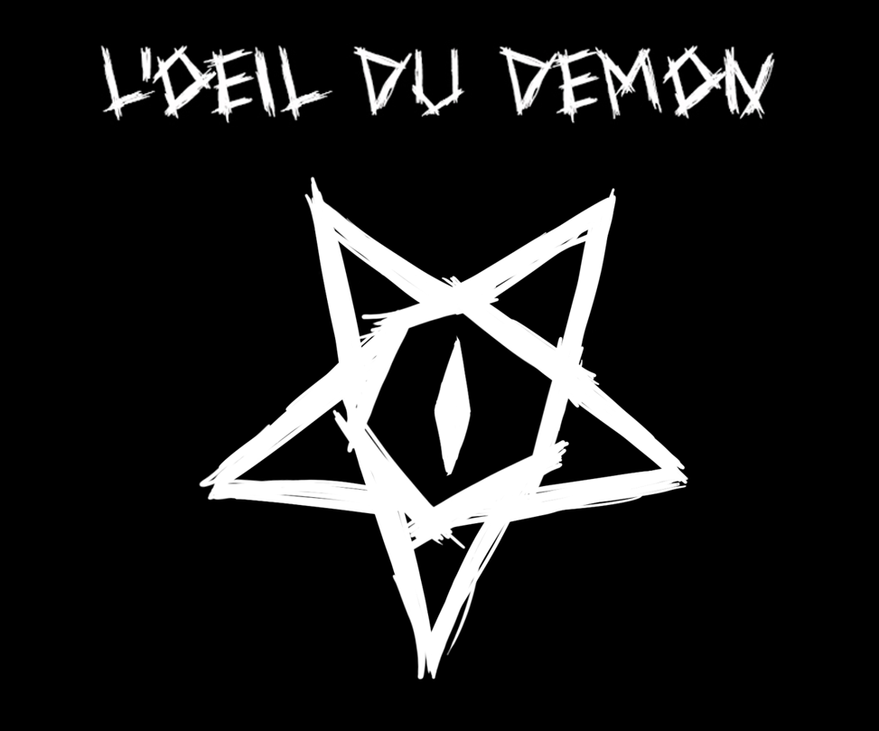
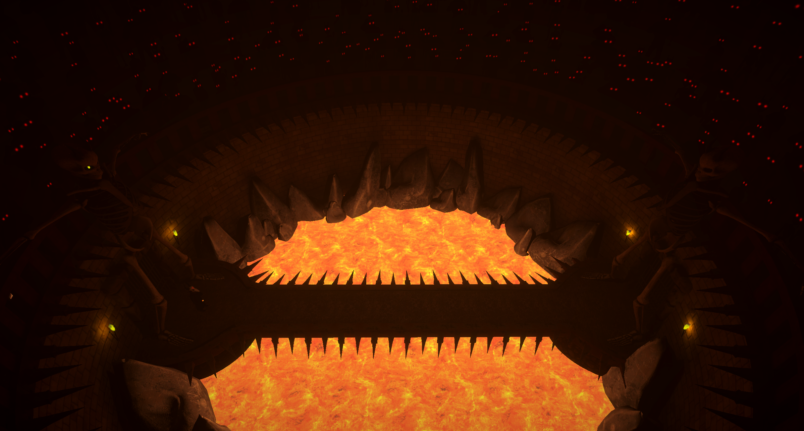

<i>
"L'Œil du Démon se déroule dans un univers de dark fantasy où vous devez vaincre un démon lors d'un duel de magie.
Vous devrez dessiner des symboles afin de lancer des sorts tout en parant les sorts ennemis." 
</i>

https://github.com/Thalzen/Oeil_du_demon/assets/120110544/323299c3-1d24-4057-a7b4-b700bef24fe8

